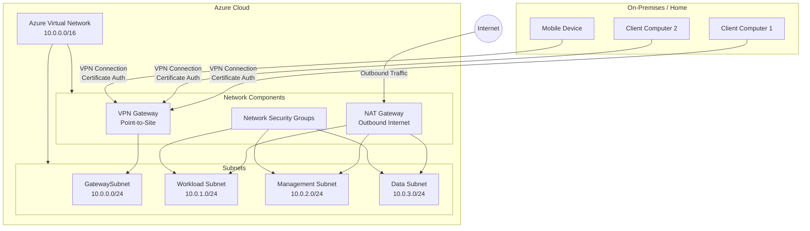

# High-Level Architecture

## Overview
This document outlines the high-level architecture of our Azure cloud environment, detailing the virtual network design, network components, subnet layout, and connectivity from on-premises or home environments.

## Architecture Diagram

## Key Components

### Client Access
- **Client Devices**: Connect to the Azure network via Point-to-Site (P2S) VPN connections
- **VPN Gateway**: Provides secure encrypted tunnels for client connections
- **Key Vault**: Stores and manages certificates used for VPN authentication

### Network Segmentation
- **Gateway Subnet**: Dedicated subnet for the VPN Gateway
- **Management Subnet**: Contains the Jump Box VM that serves as the entry point for administrative access
- **Application Subnet**: Hosts application servers
- **Database Subnet**: Contains database servers with restricted access

### Security
- **Network Security Groups (NSGs)**: Control traffic flow between subnets and resources
- **Jump Box**: Provides a secure entry point for administrative access to other resources

### Internet Connectivity
- **NAT Gateway**: Provides outbound internet connectivity for internal resources with a single shared IP address
- **VPN Gateway**: Provides internet connectivity for client VPN connections

### Monitoring & Management
- **Azure Monitor**: Provides comprehensive monitoring of all Azure resources
- **Log Analytics**: Centralizes logs for analysis and troubleshooting

## Design Principles

1. **Defense in Depth**: Multiple security layers including VPN, NSGs, and subnet isolation
2. **Least Privilege**: Resources are placed in separate subnets with appropriate access controls
3. **Centralized Management**: Jump Box VM provides a single point for administrative access
4. **Comprehensive Monitoring**: All components are monitored for security and performance

## Implementation Considerations

When implementing this architecture, consider:

1. Sizing the VPN Gateway based on expected client connections and bandwidth requirements
2. Implementing proper certificate rotation procedures for VPN authentication
3. Configuring NSGs with the minimum required rules to reduce the attack surface
4. Setting up proper logging and alerting for security events
5. Implementing backup and disaster recovery procedures for critical VMs

## All Components

### Azure Virtual Network
- **Address Space**: 10.0.0.0/16 (65,536 IP addresses)
- **Purpose**: Provides isolated network environment for all Azure resources
- **Region**: Primary deployment in East US 2 for optimal performance/cost balance

### Network Components

#### VPN Gateway
- **Type**: Point-to-Site VPN Gateway
- **Authentication**: Certificate-based authentication
- **SKU**: Basic (upgradable to VpnGw1 as needed)
- **Purpose**: Enables secure remote access from client devices to Azure resources

#### NAT Gateway
- **Configuration**: Single public IP address for outbound connectivity
- **Purpose**: Provides outbound internet access for resources in all subnets
- **Management**: Can be enabled/disabled to optimize costs

#### Network Security Groups (NSGs)
- **Implementation**: Subnet-level NSGs with specific rules for each subnet
- **Purpose**: Enforces network-level security policies and access controls
- **Management**: Centrally managed through Azure Policy

### Subnet Layout

#### GatewaySubnet
- **Address Range**: 10.0.0.0/24 (254 usable IPs)
- **Purpose**: Reserved for Azure VPN Gateway
- **Note**: No other resources should be deployed in this subnet

#### Workload Subnet
- **Address Range**: 10.0.1.0/24 (254 usable IPs)
- **Purpose**: Hosts application servers, web servers, and workload VMs
- **Security**: Protected by NSG with application-specific rules

#### Management Subnet
- **Address Range**: 10.0.2.0/24 (254 usable IPs)
- **Purpose**: Hosts jump boxes and administrative tools
- **Security**: Highly restricted access through NSG rules

#### Data Subnet
- **Address Range**: 10.0.3.0/24 (254 usable IPs)
- **Purpose**: Hosts database servers and storage resources
- **Security**: Limited access from workload and management subnets only

## Connectivity

### Remote Access
- Client devices connect via Point-to-Site VPN using certificate authentication
- VPN client configuration distributed to authorized users
- Mobile device support through Azure VPN Client app

### Internet Connectivity
- Outbound internet access provided through NAT Gateway
- Single public IP for all outbound connections
- No direct inbound access from the internet to any resources

## Security Considerations
- All subnets protected by NSGs with principle of least privilege
- No direct internet exposure of any resources
- Certificate-based authentication for VPN access
- Regular security assessments and compliance checks

## Scalability and Future Expansion
- Virtual network design allows for additional subnets as needed
- VPN Gateway can be upgraded to support more connections
- NAT Gateway can scale to support increased outbound traffic
