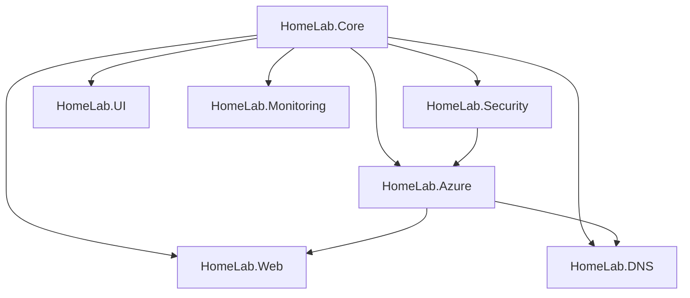

# Development Guide

This guide covers setting up a development environment, coding standards, and contribution guidelines for the HomeLab project.

## Quick Start

### Prerequisites

- **PowerShell 7.2+**: `winget install Microsoft.PowerShell`
- **Git**: `winget install Git.Git`
- **Azure CLI**: `winget install Microsoft.AzureCLI`
- **Azure PowerShell**: `Install-Module -Name Az -AllowClobber -Force`
- **VS Code** (recommended): `winget install Microsoft.VisualStudioCode`

### Development Setup

1. **Clone Repository**
```bash
git clone https://github.com/JustAGhosT/home-lab-setup.git
cd home-lab-setup
```

1. **Install Development Dependencies**
```powershell
# Install required modules
Install-Module -Name Pester -MinimumVersion 5.0 -Force
Install-Module -Name PSScriptAnalyzer -Force
Install-Module -Name PowerShell-Yaml -Force

# Install optional modules for enhanced development
Install-Module -Name PScribo -Force  # For report generation
Install-Module -Name ImportExcel -Force  # For Excel integration
```

1. **Configure Development Environment**
```powershell
# Set up development configuration
$devConfig = @{
    environment = "dev"
    logLevel = "Debug"
    testMode = $true
}
$devConfig | ConvertTo-Json | Out-File "$env:USERPROFILE\HomeLab\dev-config.json"
```

1. **Verify Setup**
```powershell
# Import the module
Import-Module .\HomeLab.psd1

# Run basic tests
cd tests
.\Run-HomeLab-Tests.ps1 -TestType Unit
```

## Project Structure

```
home-lab-setup/
├── HomeLab/                    # Main PowerShell module
│   ├── modules/               # Sub-modules
│   │   ├── HomeLab.Core/     # Core functionality
│   │   ├── HomeLab.Azure/    # Azure integration
│   │   ├── HomeLab.Security/ # Security features
│   │   ├── HomeLab.Web/      # Web deployment
│   │   ├── HomeLab.DNS/      # DNS management
│   │   ├── HomeLab.UI/       # User interface
│   │   └── HomeLab.Monitoring/ # Monitoring
│   ├── HomeLab.psd1          # Module manifest
│   └── HomeLab.psm1          # Module entry point
├── tests/                     # Test suite
│   ├── unit/                 # Unit tests
│   ├── integration/          # Integration tests
│   ├── workflow/             # Workflow tests
│   └── Run-HomeLab-Tests.ps1 # Test runner
├── docs/                     # Documentation
├── .github/                  # GitHub workflows
└── scripts/                  # Utility scripts
```

## Module Architecture

### Core Modules

#### HomeLab.Core
**Purpose**: Foundation functionality
**Components**:
- Configuration management
- Logging system
- Utility functions
- Error handling

#### HomeLab.Azure
**Purpose**: Azure service integration
**Components**:
- Resource deployment
- Service management
- Authentication
- Cost monitoring

#### HomeLab.Security
**Purpose**: Security features
**Components**:
- Certificate management
- VPN configuration
- Access control
- Security scanning

### Module Dependencies



## Coding Standards

### PowerShell Style Guide

#### Function Naming
```powershell
# Use approved verbs
Get-HomeLabConfiguration     # ✓ Good
Retrieve-HomeLabConfig       # ✗ Bad

# Use PascalCase for functions
Deploy-VPNGateway           # ✓ Good
deploy-vpn-gateway          # ✗ Bad
```

#### Parameter Conventions
```powershell
function Deploy-Website {
    [CmdletBinding()]
    param(
        # Use full parameter names
        [Parameter(Mandatory = $true)]
        [string]$ResourceGroupName,    # ✓ Good
        
        # Avoid abbreviations
        [Parameter()]
        [string]$RGName                # ✗ Bad
    )
}
```

#### Error Handling
```powershell
# Use try-catch for external calls
try {
    $result = Invoke-AzRestMethod -Uri $uri
    if ($result.StatusCode -ne 200) {
        throw "API call failed with status $($result.StatusCode)"
    }
}
catch {
    Write-Error "Failed to call Azure API: $($_.Exception.Message)"
    throw
}
```

#### Documentation
```powershell
function Deploy-Website {
    <#
    .SYNOPSIS
        Deploys a website to Azure App Service.
    
    .DESCRIPTION
        This function deploys a website to Azure App Service with support for
        custom domains, SSL certificates, and multiple environments.
    
    .PARAMETER ResourceGroupName
        The name of the Azure resource group.
    
    .PARAMETER WebsiteName
        The name of the website to deploy.
    
    .EXAMPLE
        Deploy-Website -ResourceGroupName "rg-web" -WebsiteName "mysite"
        
        Deploys a website named "mysite" to the "rg-web" resource group.
    
    .OUTPUTS
        System.Object
        Returns deployment status and URL information.
    #>
}
```

### Code Quality Tools

#### PSScriptAnalyzer Rules
```powershell
# Run analysis
Invoke-ScriptAnalyzer -Path .\HomeLab\ -Recurse

# Custom rules in .vscode/settings.json
{
    "powershell.scriptAnalysis.settingsPath": ".vscode/PSScriptAnalyzerSettings.psd1"
}
```

#### Formatting Standards
- **Indentation**: 4 spaces (no tabs)
- **Line Length**: 120 characters maximum
- **Braces**: Opening brace on same line
- **Quotes**: Use double quotes for strings with variables

## Testing Guidelines

### Test Structure
```powershell
Describe "Deploy-Website" {
    BeforeAll {
        # Setup test environment
        $testResourceGroup = "test-rg-$(Get-Random)"
    }
    
    Context "When deploying to App Service" {
        It "Should create app service successfully" {
            # Arrange
            $params = @{
                ResourceGroupName = $testResourceGroup
                WebsiteName = "test-site"
                DeploymentType = "appservice"
            }
            
            # Act
            $result = Deploy-Website @params
            
            # Assert
            $result.Status | Should -Be "Success"
            $result.Url | Should -Match "azurewebsites.net"
        }
    }
    
    AfterAll {
        # Cleanup
        Remove-AzResourceGroup -Name $testResourceGroup -Force
    }
}
```

### Mocking Guidelines
```powershell
# Mock Azure cmdlets in unit tests
BeforeAll {
    Mock New-AzResourceGroup { 
        return @{ ResourceGroupName = "test-rg" }
    }
    Mock New-AzWebApp {
        return @{ DefaultHostName = "test.azurewebsites.net" }
    }
}
```

## Development Workflow

### Feature Development

1. **Create Feature Branch**
```bash
git checkout -b feature/new-deployment-type
```

1. **Implement Feature**
- Write function with proper documentation
- Add parameter validation
- Include error handling
- Follow coding standards

1. **Write Tests**
- Unit tests for all functions
- Integration tests for Azure interactions
- Workflow tests for end-to-end scenarios

1. **Run Quality Checks**
```powershell
# Run tests
.\tests\Run-HomeLab-Tests.ps1

# Run script analysis
Invoke-ScriptAnalyzer -Path .\HomeLab\ -Recurse

# Check formatting
# Use VS Code PowerShell extension formatter
```

1. **Submit Pull Request**
- Include clear description
- Reference related issues
- Ensure all checks pass

### Code Review Process

#### Review Checklist
- [ ] Code follows style guidelines
- [ ] Functions have proper documentation
- [ ] Tests cover new functionality
- [ ] No hardcoded values or secrets
- [ ] Error handling is appropriate
- [ ] Performance considerations addressed

#### Review Guidelines
- Focus on functionality and maintainability
- Suggest improvements, don't just criticize
- Test the changes locally when possible
- Approve only when confident in the changes

## Debugging

### Local Debugging
```powershell
# Enable debug logging
$DebugPreference = "Continue"

# Use Write-Debug for debug output
Write-Debug "Processing resource group: $ResourceGroupName"

# Use breakpoints in VS Code
# Set breakpoint and run with F5
```

### Azure Debugging
```powershell
# Enable Azure debug logging
$env:AZURE_HTTP_USER_AGENT = "HomeLab-Debug"

# Use Azure CLI debug mode
az account show --debug

# Check Azure activity logs
Get-AzLog -ResourceGroup $ResourceGroupName
```

## Performance Considerations

### PowerShell Performance
- Use `[System.Collections.ArrayList]` for large collections
- Avoid `Write-Host` in functions (use `Write-Output`)
- Use `Where-Object` with script blocks for complex filtering
- Cache expensive operations

### Azure API Performance
- Use batch operations when available
- Implement retry logic with exponential backoff
- Use async operations for long-running tasks
- Monitor API rate limits

## Security Guidelines

### Secrets Management
```powershell
# Never hardcode secrets
$connectionString = "Server=..."  # ✗ Bad

# Use secure storage
$secret = Get-AzKeyVaultSecret -VaultName $vaultName -Name $secretName  # ✓ Good
```

### Input Validation
```powershell
function Deploy-Website {
    param(
        [Parameter(Mandatory = $true)]
        [ValidatePattern('^[a-zA-Z0-9-]+$')]
        [string]$WebsiteName,
        
        [Parameter()]
        [ValidateSet('dev', 'staging', 'prod')]
        [string]$Environment = 'dev'
    )
}
```

## Documentation Standards

### README Files
Each module should have a README.md with:
- Purpose and overview
- Installation instructions
- Usage examples
- API reference
- Contributing guidelines

### Code Comments
- Explain **why**, not **what**
- Use comments for complex business logic
- Keep comments up-to-date with code changes
- Use TODO comments for future improvements

### API Documentation
- Use PowerShell help system
- Include examples for all public functions
- Document parameter types and validation
- Specify return types and formats

## Release Process

### Version Management
- Use semantic versioning (MAJOR.MINOR.PATCH)
- Update version in module manifest
- Tag releases in Git
- Maintain CHANGELOG.md

### Release Checklist
- [ ] All tests pass
- [ ] Documentation updated
- [ ] Version number incremented
- [ ] CHANGELOG.md updated
- [ ] Security review completed
- [ ] Performance testing done

## Troubleshooting Development Issues

### Common Issues

#### Module Import Errors
```powershell
# Clear module cache
Remove-Module HomeLab -Force
Import-Module .\HomeLab.psd1 -Force
```

#### Azure Authentication Issues
```powershell
# Clear Azure context
Clear-AzContext -Force
Connect-AzAccount
```

#### Test Failures
```powershell
# Run specific test
Invoke-Pester -Path .\tests\unit\HomeLab.Core.tests.ps1 -Tag "Configuration"
```

## Contributing

### Getting Help
- Check existing documentation
- Search GitHub issues
- Ask questions in discussions
- Contact maintainers

### Contribution Types
- Bug fixes
- New features
- Documentation improvements
- Test coverage improvements
- Performance optimizations

### Recognition
Contributors are recognized in:
- CHANGELOG.md
- README.md acknowledgments
- GitHub contributors page

## Related Documentation

- [Testing Guide](TESTING.md)
- [GitHub Integration](GITHUB-INTEGRATION.md)
- [Security Checklist](SECURITY-CHECKLIST.md)
- [API Reference](API-REFERENCE.md)