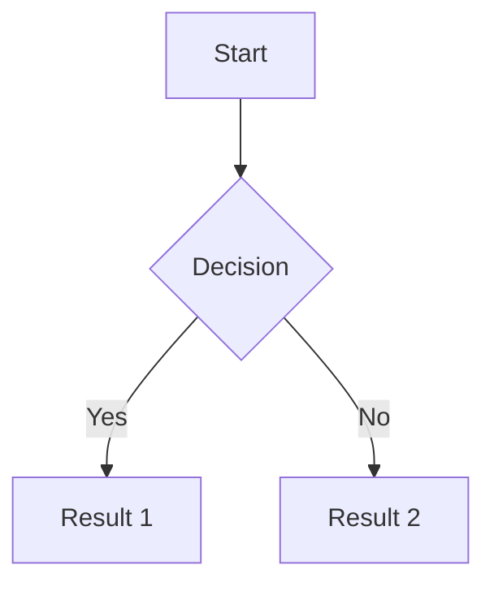

## Network Diagrams

This section contains various network diagrams that visualize different aspects of the Azure HomeLab VPN setup. These diagrams are designed to help you understand the architecture, traffic flow, security configurations, and other important aspects of the network.

## Available Diagrams

### Core Architecture

- [High-Level Architecture](high-level-architecture.html) - Overview of the entire Azure virtual network design
- [Subnet Layout](subnet-layout.html) - Detailed subnet organization and IP addressing scheme

### Network Traffic & Security

- [Traffic Flow and Routing](traffic-flow-and-routing.html) - How traffic is routed within the virtual network
- [Network Security](network-security.html) - Security groups, policies, and protection mechanisms
- [NAT Gateway Configuration](nat-gateway-configuration.html) - Outbound internet connectivity configuration

### VPN Configuration

- [Point-to-Site VPN Connection Flow](point-to-site-vpn-connection-flow.html) - How clients connect to the VPN
- [Certificate Management Flow](certificate-management-flow.html) - Certificate lifecycle for VPN authentication
- [Client Certificate Management](client-certificate-management.html) - Managing client certificates for VPN access

### Optimization & Strategy

- [Cost Optimization Strategy](cost-optimization-strategy.html) - Approaches to minimize Azure costs

## Using the Diagrams

Each diagram is created using Mermaid.js and can be viewed directly in the browser. The diagrams are interactive and can be:

1. Zoomed in/out for better visibility
2. Saved as images for documentation
3. Referenced during implementation

## Contributing

To modify or add new diagrams:

1. Create a new markdown file in the `docs/diagrams` directory
2. Use the following template:

```markdown
---
layout: default
title: Your Diagram Title
---

# Your Diagram Title

Brief description of what this diagram shows.

## Diagram



## Explanation

Explain the key components and interactions shown in the diagram.
```

## Diagram Standards

For consistency across all diagrams, please follow these standards:

- Use standard flowchart notation for process flows
- Use consistent color coding:
  - Azure resources: Blue
  - Security elements: Red
  - Client/on-premises: Green
  - Data flow: Purple arrows
- Include a legend where appropriate
- Keep diagrams focused on a single aspect of the system
