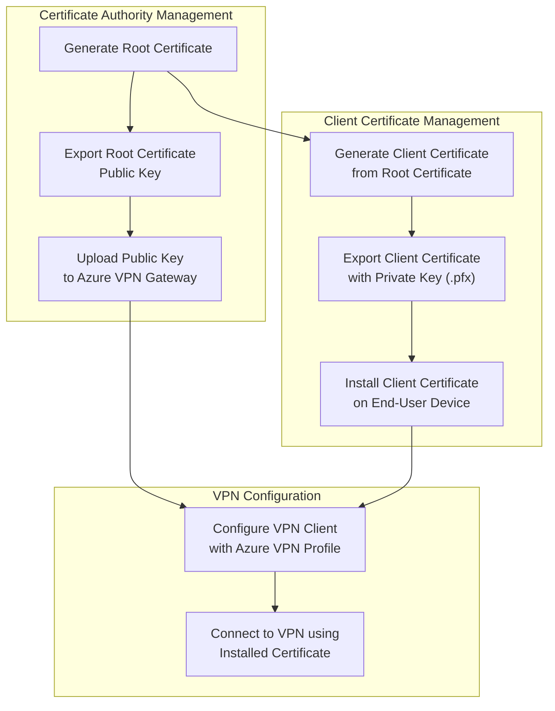

# Certificate Management Flow

## Overview
This document outlines the process of managing certificates for the Azure Point-to-Site VPN connection. The certificate-based authentication provides secure access to the Azure virtual network resources from client devices.

## Certificate Management Process

## Process Steps Explained

### Certificate Authority Management
1. **Generate Root Certificate**: Create a self-signed root certificate using PowerShell or OpenSSL that will act as the Certificate Authority (CA).
2. **Export Root Certificate Public Key**: Extract the public key portion of the root certificate in .cer format.
3. **Upload to Azure VPN Gateway**: Upload the public key to the Azure VPN Gateway to establish trust.

### Client Certificate Management
1. **Generate Client Certificate**: Create client certificates signed by the root certificate for each user or device.
2. **Export Client Certificate with Private Key**: Export the client certificate with its private key in .pfx format.
3. **Install Client Certificate**: Install the client certificate on each end-user device that needs VPN access.

### VPN Configuration
1. **Configure VPN Client**: Download and install the Azure VPN client profile on the end-user device.
2. **Connect to VPN**: Establish the VPN connection using the installed certificate for authentication.

## Best Practices
- Store the root certificate private key securely; compromise would allow unauthorized client certificate creation
- Implement certificate revocation procedures for compromised certificates or departing employees
- Consider certificate expiration dates and plan for renewal
- Document the certificate hierarchy and management procedures

## Troubleshooting
- Verify certificate chain validity
- Check certificate expiration dates
- Ensure the client has the correct certificate installed in the personal certificate store
- Confirm the root certificate public key is correctly uploaded to the Azure VPN Gateway
