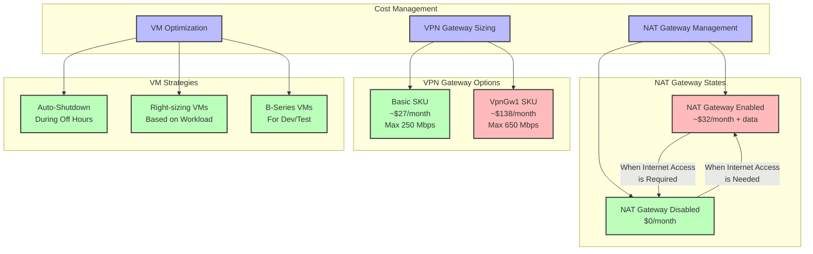

# Cost Optimization Strategy

## Overview
This document outlines the cost optimization strategies for our Azure infrastructure, focusing on NAT Gateway management, VPN Gateway sizing, and VM optimization to reduce operational expenses while maintaining required functionality.

## Cost Optimization Diagram

## NAT Gateway Management

### Cost Considerations
- **Enabled State**: ~$32/month plus data processing charges
- **Disabled State**: $0/month (no charges when disabled)

### Optimization Strategy
- Enable the NAT Gateway only when outbound internet access is required
- Schedule automatic disabling during non-business hours
- Consider implementing scripts to enable/disable based on actual usage patterns
- Monitor outbound data transfer to optimize cost

## VPN Gateway Sizing

### SKU Comparison
- **Basic SKU**: ~$27/month with max throughput of 250 Mbps
  - Suitable for small teams and limited concurrent connections
  - Does not support BGP or active-active configuration
- **VpnGw1 SKU**: ~$138/month with max throughput of 650 Mbps
  - Supports more concurrent connections and higher bandwidth
  - Necessary for larger teams or higher performance requirements

### Optimization Strategy
- Start with Basic SKU for development and testing
- Monitor performance metrics to determine if upgrade is necessary
- Consider scheduled scaling for periodic high-demand scenarios

## VM Optimization Strategies

### Auto-Shutdown
- Configure development and test VMs to automatically shut down during non-working hours
- Implement using Azure Auto-Shutdown feature or Azure Automation runbooks
- Potential savings: 50-70% cost reduction for non-production workloads

### Right-Sizing
- Analyze VM performance metrics to identify over-provisioned resources
- Adjust VM size based on actual CPU, memory, and disk utilization
- Consider vertical scaling (changing VM size) for consistent workloads

### Burstable VMs (B-Series)
- Use B-Series VMs for workloads with variable utilization patterns
- Accumulate credits during low usage periods for use during high-demand periods
- Ideal for development, testing, and low-traffic web servers

## Implementation Plan
1. Establish baseline costs for current infrastructure
2. Implement monitoring for resource utilization
3. Apply optimization strategies incrementally
4. Measure cost impact and adjust as needed

## Monitoring and Reporting
- Set up Azure Cost Management budgets and alerts
- Create weekly cost review process
- Document cost savings achieved through optimization
