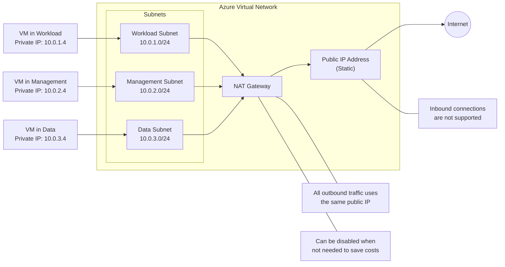

# NAT Gateway Configuration

## Overview
This document details the configuration and operation of the Azure NAT Gateway within our virtual network, explaining how it provides outbound internet connectivity for resources across multiple subnets while maintaining a single public IP address.

## NAT Gateway Architecture



## NAT Gateway Components

### Public IP Address
- **Type**: Static public IP address
- **SKU**: Standard
- **Purpose**: Provides a consistent outbound IP for all resources
- **Configuration**: Associated with the NAT Gateway resource

### NAT Gateway Resource
- **SKU**: Standard
- **Idle Timeout**: 4 minutes (configurable up to 120 minutes)
- **Subnet Association**: Applied to Workload, Management, and Data subnets

## Key Features and Limitations

### Features
- **Simplified Outbound Connectivity**: All VMs use the same public IP address for outbound connections
- **No Inbound NAT Required**: Eliminates need for individual public IPs or inbound NAT rules
- **High Throughput**: Supports up to 50,000 concurrent connections per assigned IP
- **Subnet-Level Association**: Applied at subnet level rather than individual VMs
- **Cost Optimization**: Can be disabled when not needed to save costs

### Limitations
- **Outbound-Only**: Does not support inbound connections from the internet
- **Single Region**: NAT Gateway is a regional resource and only works with resources in the same region
- **Subnet Association**: A subnet can be associated with only one NAT Gateway

## Configuration Details

### PowerShell Commands for Setup
```powershell
# Create a public IP address for the NAT gateway
$publicIp = New-AzPublicIpAddress -Name "nat-gateway-pip" -ResourceGroupName "homelab-rg" -Location "EastUS2" -Sku "Standard" -AllocationMethod "Static"

# Create the NAT gateway
$natGateway = New-AzNatGateway -Name "homelab-nat-gateway" -ResourceGroupName "homelab-rg" -Location "EastUS2" -Sku "Standard" -PublicIpAddress $publicIp -IdleTimeoutInMinutes 4

# Associate the NAT gateway with subnets
$vnet = Get-AzVirtualNetwork -Name "homelab-vnet" -ResourceGroupName "homelab-rg"
$workloadSubnet = Get-AzVirtualNetworkSubnetConfig -Name "WorkloadSubnet" -VirtualNetwork $vnet
$workloadSubnet.NatGateway = $natGateway

$managementSubnet = Get-AzVirtualNetworkSubnetConfig -Name "ManagementSubnet" -VirtualNetwork $vnet
$managementSubnet.NatGateway = $natGateway

$dataSubnet = Get-AzVirtualNetworkSubnetConfig -Name "DataSubnet" -VirtualNetwork $vnet
$dataSubnet.NatGateway = $natGateway

$vnet | Set-AzVirtualNetwork
```

### Enabling/Disabling for Cost Optimization
```powershell
# Disable NAT Gateway (stop billing for gateway while keeping the resource)
$natGateway = Get-AzNatGateway -Name "homelab-nat-gateway" -ResourceGroupName "homelab-rg"
$natGateway.Sku.Name = "Disabled"
$natGateway | Set-AzNatGateway

# Re-enable NAT Gateway when needed
$natGateway = Get-AzNatGateway -Name "homelab-nat-gateway" -ResourceGroupName "homelab-rg"
$natGateway.Sku.Name = "Standard"
$natGateway | Set-AzNatGateway
```

## Monitoring and Troubleshooting

### Key Metrics to Monitor
- **SNAT Port Utilization**: Monitor to ensure sufficient ports are available
- **Dropped Packets**: Indicates potential capacity issues
- **Packet Count**: Tracks overall utilization

### Common Issues and Solutions
- **Port Exhaustion**: If SNAT port utilization is high, consider adding additional public IPs
- **Connectivity Issues**: Verify subnet associations and NAT Gateway status
- **Outbound Failures**: Check NSG rules that might be blocking outbound traffic

## Cost Considerations
- Standard NAT Gateway: ~$32/month (when enabled)
- Data Processing: $0.045 per GB processed
- Public IP Address: ~$3.60/month
- Consider scheduling disable/enable cycles for non-business hours
