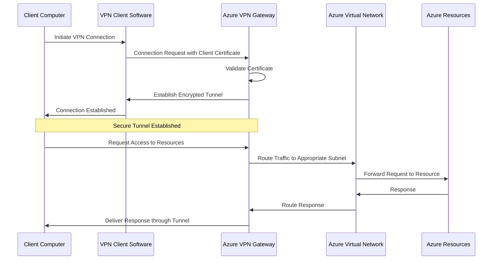

# Point-to-Site VPN Connection Flow

## Overview
This document describes the connection flow for Point-to-Site (P2S) VPN connections from client devices to Azure resources. It details the authentication process, tunnel establishment, and traffic routing within the secure connection.

## Connection Flow Diagram

## Connection Process Details

### 1. Connection Initiation
- **Client Computer**: End-user initiates a VPN connection using the Azure VPN Client software
- **Connection Parameters**: 
  - VPN Server: Azure VPN Gateway public IP or DNS name
  - Authentication Type: Certificate-based authentication
  - Protocol: IKEv2 or SSTP (based on client configuration)

### 2. Authentication
- **Certificate Presentation**: Client presents its certificate to the VPN Gateway
- **Validation Process**:
  - VPN Gateway verifies the client certificate is valid
  - Confirms the certificate was issued by the trusted root certificate
  - Checks certificate has not expired or been revoked
  - Validates any additional certificate properties (if configured)

### 3. Tunnel Establishment
- **Protocol Negotiation**: Client and Gateway agree on encryption protocols and parameters
- **Secure Channel**: An encrypted tunnel is established between the client and VPN Gateway
- **IP Assignment**: Client receives a private IP address from the VPN address pool
- **Connection Confirmation**: VPN Client software indicates successful connection

### 4. Resource Access
- **Traffic Routing**: All traffic destined for the virtual network is routed through the VPN tunnel
- **Network Access**: Client can now access resources in the virtual network based on NSG rules
- **Subnet Routing**: VPN Gateway routes traffic to the appropriate subnet within the VNet
- **Response Path**: Return traffic follows the same encrypted path back to the client

## Technical Specifications

### VPN Protocols
- **IKEv2**: Primary protocol for Windows 10+ clients
  - Benefits: Auto-reconnect, stability, native support
  - Requirements: UDP ports 500 and 4500 must be open
- **SSTP**: Fallback protocol for restricted networks
  - Benefits: Works over TCP 443, can traverse most firewalls
  - Limitations: Windows-only, slightly lower performance

### Encryption and Security
- **Authentication**: Certificate-based (preferred) or RADIUS
- **Encryption**: AES-256 for data encryption
- **Integrity**: SHA-256 for data integrity
- **Perfect Forward Secrecy**: Enabled by default

### Performance Considerations
- **Throughput**: Limited by VPN Gateway SKU (250 Mbps for Basic, 650 Mbps for VpnGw1)
- **Latency**: Typically adds 5-20ms depending on client location and internet conditions
- **Concurrent Connections**: Maximum connections depend on Gateway SKU
  - Basic: Up to 10 concurrent connections
  - VpnGw1: Up to 100 concurrent connections

## Troubleshooting Common Issues

### Connection Failures
- **Certificate Issues**: Verify client certificate is valid and installed in the correct store
- **Network Restrictions**: Check if required ports are blocked by client firewall
- **Gateway Status**: Confirm VPN Gateway is running and healthy

### Performance Problems
- **Bandwidth Limitations**: Check if Gateway SKU is sufficient for number of clients
- **Client Internet Connection**: Test client internet speed and latency
- **Resource Contention**: Monitor Gateway CPU and memory utilization

### Disconnections
- **Idle Timeout**: Default disconnect after 30 minutes of inactivity
- **Network Changes**: Connection may drop when client network changes
- **VPN Gateway Maintenance**: Azure maintenance can cause brief disconnections

## Client Setup Requirements
- Azure VPN Client application installed
- Client certificate properly installed in the Personal certificate store
- Necessary network ports open on client firewall
- Sufficient permissions to establish VPN connections
