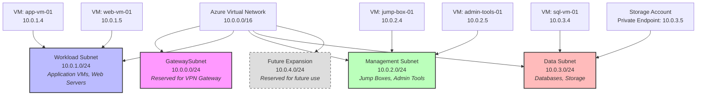

# Subnet Layout

## Overview
This document details the subnet architecture within our Azure Virtual Network, explaining the purpose, IP address ranges, and resource allocation for each subnet to ensure proper network segmentation and security.

## Subnet Layout Diagram



## Subnet Definitions

### GatewaySubnet
- **CIDR Range**: 10.0.0.0/24 (254 usable IP addresses)
- **Purpose**: Dedicated subnet required for Azure VPN Gateway deployment
- **Special Considerations**:
  - Must be named exactly "GatewaySubnet" (case-sensitive)
  - Minimum recommended size is /27, but /24 provides room for growth
  - No NSG should be applied directly to this subnet
  - No other resources should be deployed in this subnet
- **Current Resources**: VPN Gateway instance

### Workload Subnet
- **CIDR Range**: 10.0.1.0/24 (254 usable IP addresses)
- **Purpose**: Hosts application servers, web servers, and workload VMs
- **Security Controls**:
  - NSG allows HTTP/HTTPS access from VPN clients
  - NSG allows management access from Management subnet
  - All outbound internet traffic routed through NAT Gateway
- **Current Resources**:
  - app-vm-01 (10.0.1.4): Application server
  - web-vm-01 (10.0.1.5): Web server
- **IP Allocation Strategy**:
  - 10.0.1.4 - 10.0.1.20: Reserved for static IP assignments
  - 10.0.1.21 - 10.0.1.254: Dynamic IP pool

### Management Subnet
- **CIDR Range**: 10.0.2.0/24 (254 usable IP addresses)
- **Purpose**: Hosts jump boxes and administrative tools
- **Security Controls**:
  - NSG allows RDP/SSH access only from VPN clients
  - Highly restricted access through NSG rules
  - All outbound internet traffic routed through NAT Gateway
- **Current Resources**:
  - jump-box-01 (10.0.2.4): Primary jump box for administrative access
  - admin-tools-01 (10.0.2.5): VM hosting administrative tools
- **IP Allocation Strategy**:
  - 10.0.2.4 - 10.0.2.20: Reserved for static IP assignments
  - 10.0.2.21 - 10.0.2.254: Dynamic IP pool

### Data Subnet
- **CIDR Range**: 10.0.3.0/24 (254 usable IP addresses)
- **Purpose**: Hosts database servers and storage resources
- **Security Controls**:
  - NSG allows SQL access only from Workload subnet
  - NSG allows management access from Management subnet
  - All outbound internet traffic routed through NAT Gateway
- **Current Resources**:
  - sql-vm-01 (10.0.3.4): SQL Server database
  - Storage Account Private Endpoint (10.0.3.5): Azure Storage private endpoint
- **IP Allocation Strategy**:
  - 10.0.3.4 - 10.0.3.20: Reserved for static IP assignments
  - 10.0.3.21 - 10.0.3.50: Reserved for private endpoints
  - 10.0.3.51 - 10.0.3.254: Dynamic IP pool

### Future Expansion Subnet
- **CIDR Range**: 10.0.4.0/24 (254 usable IP addresses)
- **Purpose**: Reserved for future use and expansion
- **Current Status**: Not currently in use
- **Planned Usage**: Potential dedicated subnet for Azure PaaS services or specialized workloads

## IP Address Management

### DHCP Configuration
- DHCP enabled for all subnets
- DNS servers configured at VNet level:
  - Primary: Azure-provided DNS (168.63.129.16)
  - Secondary: Custom DNS server (if applicable)

### Reserved IP Ranges
- First 4 IP addresses in each subnet (.0 - .3) reserved by Azure
- Last IP address in each subnet (.255) reserved by Azure
- Lower range (.4 - .20) in each subnet reserved for static assignments
- Mid-range in Data subnet (.21 - .50) reserved for private endpoints

## Network Security

### NSG Assignments
- Each subnet (except GatewaySubnet) has a dedicated NSG
- NSGs follow least-privilege principle
- Detailed NSG rules documented in network-security.md

### Service Endpoints
- Microsoft.Sql service endpoint enabled on Workload and Management subnets
- Microsoft.Storage service endpoint enabled on all subnets

## Implementation Notes

### Subnet Creation Commands
```powershell
# Create the Virtual Network with GatewaySubnet
$vnet = New-AzVirtualNetwork -Name "homelab-vnet" -ResourceGroupName "homelab-rg" -Location "EastUS2" -AddressPrefix "10.0.0.0/16"
Add-AzVirtualNetworkSubnetConfig -Name "GatewaySubnet" -VirtualNetwork $vnet -AddressPrefix "10.0.0.0/24"
$vnet | Set-AzVirtualNetwork

# Add remaining subnets
Add-AzVirtualNetworkSubnetConfig -Name "WorkloadSubnet" -VirtualNetwork $vnet -AddressPrefix "10.0.1.0/24"
Add-AzVirtualNetworkSubnetConfig -Name "ManagementSubnet" -VirtualNetwork $vnet -AddressPrefix "10.0.2.0/24"
Add-AzVirtualNetworkSubnetConfig -Name "DataSubnet" -VirtualNetwork $vnet -AddressPrefix "10.0.3.0/24"
Add-AzVirtualNetworkSubnetConfig -Name "FutureSubnet" -VirtualNetwork $vnet -AddressPrefix "10.0.4.0/24"
$vnet | Set-AzVirtualNetwork
```

### Future Considerations
- Monitor subnet IP utilization and plan for expansion if needed
- Consider implementing Azure NetApp Files in a dedicated subnet for high-performance file shares
- Evaluate need for dedicated subnet for Azure Bastion as alternative to jump box
