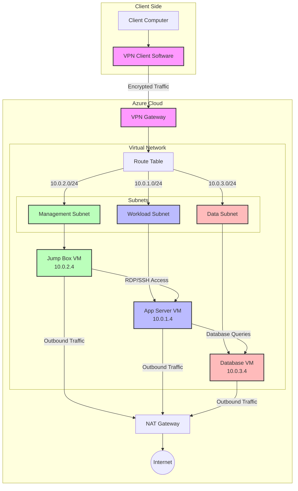

# Traffic Flow and Routing

## Overview
This document details the traffic flow patterns and routing configuration within our Azure virtual network environment, explaining how data moves between clients, VPN Gateway, subnets, and the internet through NAT Gateway.

## Traffic Flow Diagram



## Traffic Patterns

### Inbound Traffic Flow

#### VPN Client Access
1. Client computer connects to Azure VPN Gateway using certificate-based authentication
2. VPN Gateway establishes encrypted tunnel with client
3. Client receives a private IP address from the VPN client address pool (172.16.0.0/24)
4. VPN Gateway routes traffic to appropriate subnets based on destination address
5. Network Security Groups (NSGs) filter traffic according to defined rules

#### Common VPN Client Access Scenarios
- **Management Access**:
  - Client → VPN Gateway → Management Subnet → Jump Box VM
  - Allowed protocols: RDP (3389), SSH (22)
  - NSG rules enforce access restrictions

- **Application Access**:
  - Client → VPN Gateway → Workload Subnet → Application/Web Server
  - Allowed protocols: HTTP (80), HTTPS (443), Custom Application Ports
  - NSG rules enforce access restrictions

### Internal Traffic Flow

#### Cross-Subnet Communication
1. Traffic originates from VM in source subnet
2. Traffic is routed through the virtual network's internal routing system
3. NSGs on both source and destination subnets evaluate traffic against rules
4. If allowed by NSGs, traffic reaches the destination VM

#### Common Internal Traffic Scenarios
- **Management to Workload**:
  - Jump Box (10.0.2.4) → App Server (10.0.1.4)
  - Purpose: Administrative access, deployment, troubleshooting
  - Protocols: RDP, SSH, WinRM, HTTP(S)

- **Workload to Data**:
  - App Server (10.0.1.4) → Database Server (10.0.3.4)
  - Purpose: Database queries, data storage/retrieval
  - Protocols: SQL (1433), SMB (445)

- **Management to Data**:
  - Jump Box (10.0.2.4) → Database Server (10.0.3.4)
  - Purpose: Database administration, backup operations
  - Protocols: SQL (1433), RDP (3389)

### Outbound Traffic Flow

#### Internet-Bound Traffic
1. VM initiates connection to internet resource
2. Traffic is directed to NAT Gateway based on route table configuration
3. NAT Gateway translates private source IP to the public IP address
4. Return traffic is received by NAT Gateway and routed back to originating VM

#### Common Outbound Scenarios
- **Windows Updates**:
  - VMs → NAT Gateway → Windows Update Servers
  - Purpose: OS and application patching
  - Protocols: HTTP(S)

- **Package Management**:
  - VMs → NAT Gateway → Package Repositories (apt, yum, NuGet, etc.)
  - Purpose: Software installation and updates
  - Protocols: HTTP(S)

## Routing Configuration

### System Routes
- Automatically created routes for local VNet communication
- Default route (0.0.0.0/0) for internet-bound traffic

### Custom Routes
- **NAT Gateway Route**:
  - Address Prefix: 0.0.0.0/0
  - Next Hop Type: Internet
  - Applied to: All subnets
  - Purpose: Direct all internet-bound traffic through NAT Gateway

### Route Table Configuration
```powershell
# Create route table
$routeTable = New-AzRouteTable -Name "homelab-route-table" -ResourceGroupName "homelab-rg" -Location "EastUS2"

# Add custom routes if needed
# For example, to force traffic to specific networks through a network virtual appliance:
# Add-AzRouteConfig -Name "CustomRoute" -AddressPrefix "203.0.113.0/24" -NextHopType "VirtualAppliance" -NextHopIpAddress "10.0.2.10" -RouteTable $routeTable

# Associate route table with subnets
$vnet = Get-AzVirtualNetwork -Name "homelab-vnet" -ResourceGroupName "homelab-rg"
$workloadSubnet = Get-AzVirtualNetworkSubnetConfig -Name "WorkloadSubnet" -VirtualNetwork $vnet
$workloadSubnet.RouteTable = $routeTable

$managementSubnet = Get-AzVirtualNetworkSubnetConfig -Name "ManagementSubnet" -VirtualNetwork $vnet
$managementSubnet.RouteTable = $routeTable

$dataSubnet = Get-AzVirtualNetworkSubnetConfig -Name "DataSubnet" -VirtualNetwork $vnet
$dataSubnet.RouteTable = $routeTable

$vnet | Set-AzVirtualNetwork
```

## Network Security Considerations

### Traffic Isolation
- NSGs control traffic flow between subnets
- Each subnet has its own NSG with specific rules
- Traffic not explicitly allowed is denied

### Traffic Inspection
- Network Watcher can be used for packet capture and flow logs
- NSG flow logs can be sent to Log Analytics for analysis
- Traffic Analytics provides insights into traffic patterns

## Troubleshooting Traffic Flow Issues

### Common Issues and Diagnostics
1. **Connectivity Problems**:
   - Verify NSG rules on both source and destination subnets
   - Check effective routes using Network Watcher
   - Test connectivity using Network Watcher Connection Troubleshoot

2. **Performance Issues**:
   - Monitor VPN Gateway metrics for bandwidth utilization
   - Check NAT Gateway SNAT port utilization
   - Analyze VM network performance metrics

3. **Routing Problems**:
   - Verify effective routes for the VM's network interface
   - Check for conflicting custom routes
   - Ensure NAT Gateway is properly associated with subnets

### Diagnostic Commands
```powershell
# Check effective routes for a VM
Get-AzEffectiveRouteTable -NetworkInterfaceName "vm1-nic" -ResourceGroupName "homelab-rg"

# Check effective NSG rules
Get-AzEffectiveNetworkSecurityGroup -NetworkInterfaceName "vm1-nic" -ResourceGroupName "homelab-rg"

# Test connectivity between VMs
Test-AzNetworkWatcherConnectivity -NetworkWatcherName "NetworkWatcher_EastUS2" -ResourceGroupName "NetworkWatcherRG" -SourceId "/subscriptions/{subscriptionId}/resourceGroups/homelab-rg/providers/Microsoft.Compute/virtualMachines/jump-box-01" -DestinationId "/subscriptions/{subscriptionId}/resourceGroups/homelab-rg/providers/Microsoft.Compute/virtualMachines/app-vm-01" -DestinationPort 3389
```

## Performance Optimization

### Bandwidth Considerations
- VPN Gateway bandwidth limited by SKU (250 Mbps for Basic, 650 Mbps for VpnGw1)
- NAT Gateway supports up to 50 Gbps of aggregate throughput
- VM bandwidth limited by VM size and type

### Latency Optimization
- Place related resources in the same subnet when possible
- Consider proximity placement groups for latency-sensitive applications
- Monitor and optimize round-trip time between components

## Monitoring and Analytics

### Key Metrics to Monitor
- VPN Gateway: Bandwidth, connections, packets per second
- NAT Gateway: SNAT port utilization, packet drops
- Network interfaces: Bytes in/out, packets in/out

### Alerting Recommendations
- Set up alerts for high SNAT port utilization (>80%)
- Configure alerts for VPN Gateway disconnections
- Monitor for unusual traffic patterns that may indicate security issues
