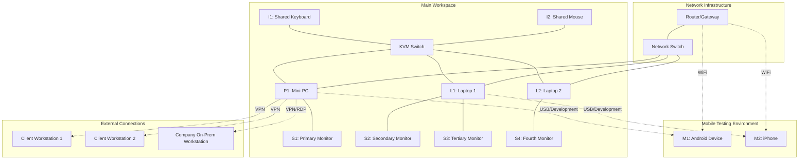
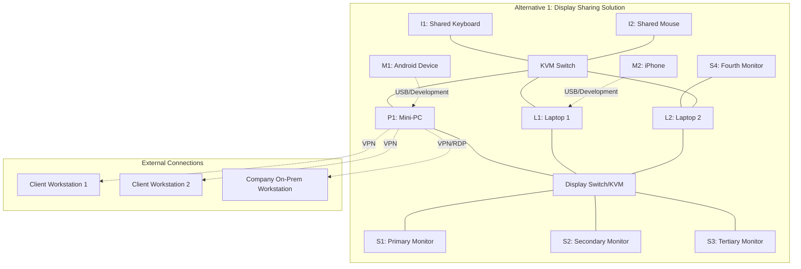
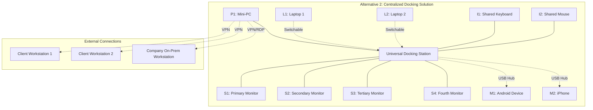
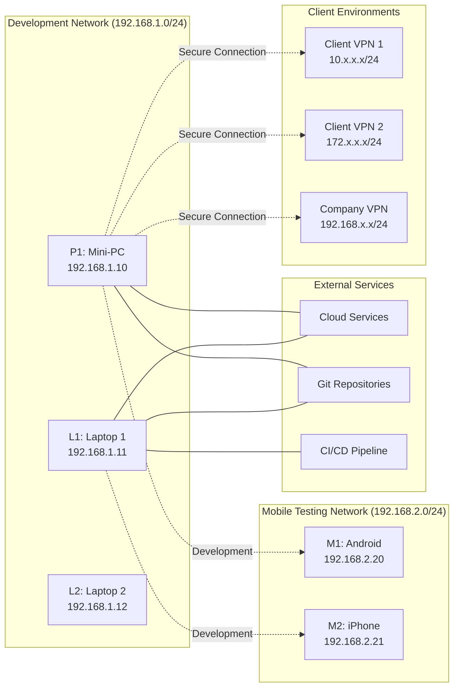
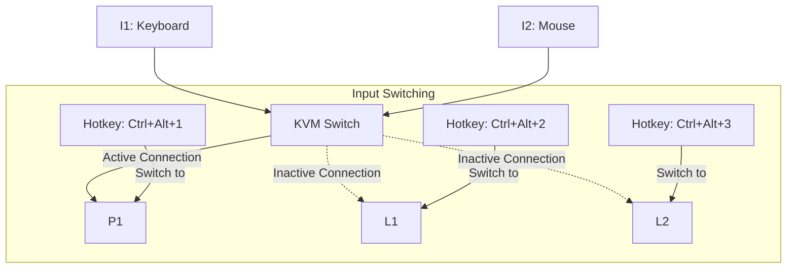
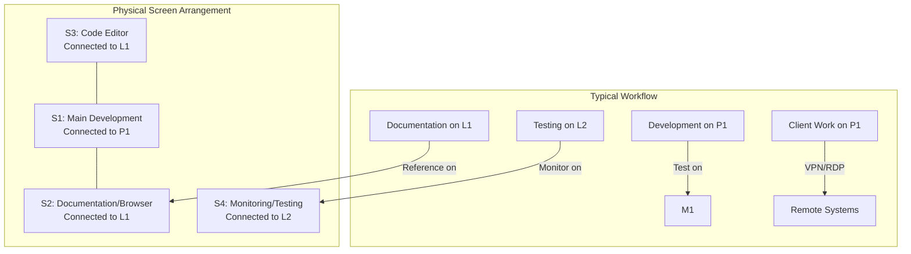

## My Home Lab Setup

### Overview

This document explains the configuration and purpose of my home lab environment, which serves as both my development workspace and a practical implementation of the architecture described in this repository.

## Physical Setup

My home lab environment consists of multiple devices and screens to create a versatile and efficient workspace:

### Computing Devices
- **P1**: Mini-PC (primary development machine)
  - Hosts VPN connections to client environments
  - Maintains RDP connections to client workstations
  - Connects via VPN/RDP to company (non-Phoenix) on-premises workstation
- **L1**: Laptop 1 (secondary development/testing machine)
- **L2**: Laptop 2 (specialized testing environment)
- **M1**: Android mobile device (for mobile testing and development)
- **M2**: iPhone mobile device (for iOS testing and cross-platform compatibility)

### Display Configuration
- **S1**: Primary monitor connected to P1 (Mini-PC)
- **S2 & S3**: Dual monitors connected to L1 (Laptop 1)
- **S4**: Additional monitor connected to L2 (Laptop 2)

### Input Devices
- **I1**: Central input keyboard shared across devices
- **I2**: Central input mouse shared across devices

## Detailed Layout Diagrams

### Current Physical Layout

### Alternative Layout 1: Display Sharing Solution

### Alternative Layout 2: Centralized Docking Solution

## Logical Network Layout

## Input Sharing System

### Central Keyboard and Mouse Setup

The central keyboard and mouse system is a critical component of my home lab setup, allowing me to control multiple devices without the clutter and inefficiency of multiple input devices.

#### KVM Switch Implementation

The current setup uses a hardware KVM (Keyboard, Video, Mouse) switch that allows:

- Seamless switching between devices using hotkeys (Ctrl+Alt+1/2/3)
- Maintaining separate video connections while sharing input devices
- Zero latency input control across all connected systems
- No software overhead or network dependency for input sharing

> For a comprehensive guide on KVM switch options, including entry-level to premium devices,
> pricing information, and detailed setup instructions, see the dedicated document at
> [KVM Switch Implementation](kvm-switch-implementation.md). This guide includes specific product recommendations
> optimized for our multi-device setup with separate video connections.

#### Software Alternative: Synergy/Barrier

As an alternative to the hardware KVM, a software solution like Synergy or Barrier could be implemented:

- Allows keyboard and mouse sharing over the network
- Supports seamless cursor movement between screens
- Enables clipboard sharing between devices
- Requires all devices to be powered on and connected to the network
- Introduces minimal latency depending on network conditions

> Explore software-based KVM alternatives in detail by referring to
> [Software Alternatives](software-kvm-alternatives.md). This document provides step-by-step setup
> instructions for Barrier (free) and Synergy (commercial), performance considerations,
> troubleshooting tips, and a comparative analysis against hardware KVM solutions for
> our specific multi-device environment.

## Alternative Screen Connection Options

### Current Setup: Direct Connections

The current setup uses direct connections from each computing device to its designated monitor(s). This provides the most reliable and lowest latency display output but limits flexibility.

### Alternative 1: Display Sharing Solution

A display switch or advanced KVM with video switching capabilities would allow:

- Connecting any device to any monitor
- Quick reconfiguration of the workspace based on current tasks
- Preservation of display settings for each device
- Potential limitations in maximum resolution or refresh rate

### Alternative 2: Centralized Docking Solution

A universal docking station approach would provide:

- Single connection point for all peripherals
- Easy swapping of the primary computing device
- Consistent monitor configuration across devices
- USB hub functionality for mobile device connections
- Potential for power delivery to laptops through the dock
- Simplified cable management

> For an in-depth analysis of universal docking station options, see
> [Centralized docking station](centralized-docking-station.md). This guide evaluates options from basic USB-C
> hubs to premium Thunderbolt 4 docking stations with KVM functionality, including
> connection diagrams, cost-benefit analysis, and specific recommendations tailored to
> our multi-device home lab configuration.

## Why This Configuration?

### Multiple Environments for Testing

This multi-device setup allows me to simultaneously:

1. Run development code on one system (P1 Mini-PC)
2. Test deployment configurations on another (L1 Laptop)
3. Monitor network traffic and security implementations in real-time (L2 Laptop)
4. Test mobile applications on both Android (M1) and iOS (M2) platforms
5. Document findings and create diagrams without interrupting workflows

### Client Environment Access

The P1 Mini-PC serves as a secure gateway to multiple client environments:

- Maintains separate VPN connections to different client networks
- Provides RDP access to client workstations for support and development
- Connects to my company's on-premises workstation for accessing internal resources
- Keeps client environments isolated from each other for security

### Cross-Platform Mobile Development

The inclusion of both Android (M1) and iOS (M2) devices enables:

- Real-time testing of mobile applications on both major platforms
- Verification of responsive designs across different screen sizes
- Testing of platform-specific features and APIs
- Debugging of platform-specific issues in a controlled environment

### Practical Implementation of Architecture

My home lab serves as a living implementation of the architecture described in this repository:

- **Network Segmentation**: Physical separation of devices mirrors the subnet layout described in [subnet-layout.md](/home-lab-setup/docs/subnet-layout.md)
- **VPN Testing**: Allows real-world testing of the point-to-site VPN connections detailed in [point-to-site-vpn-connection-flow.md](/home-lab-setup/docs/point-to-site-vpn-connection-flow.md)
- **Certificate Management**: Practical application of the certificate management processes outlined in [certificate-management-flow.md](/home-lab-setup/docs/certificate-management-flow.md)
- **Mobile Security**: Implementation of mobile security patterns and practices for both Android and iOS platforms

### Development Efficiency

The multi-screen, multi-device setup enhances development efficiency by:

- Enabling parallel workflows across different systems
- Providing dedicated space for code, documentation, and testing
- Allowing real-time monitoring of system performance during development
- Supporting seamless switching between development and testing environments
- Facilitating immediate mobile testing without context switching

### Cost Optimization

This setup implements the cost optimization strategies described in [cost-optimization-strategy.md](/home-lab-setup/docs/cost-optimization-strategy.md) by:

- Repurposing existing hardware (laptops, mini-PC, and mobile devices) rather than purchasing new equipment
- Using a shared input system (keyboard and mouse) across multiple devices
- Creating a scalable environment that can grow with project needs
- Leveraging existing mobile devices as testing platforms rather than purchasing emulators or dedicated test devices

## Technical Implementation

The home lab environment implements several key technical components:

- **Network Security**: Practical implementation of concepts from [network-security.md](/home-lab-setup/docs/network-security.md)
- **Traffic Routing**: Real-world testing of routing described in [traffic-flow-and-routing.md](/home-lab-setup/docs/traffic-flow-and-routing.md)
- **NAT Gateway**: Implementation of the NAT gateway configuration from [nat-gateway-configuration.md](/home-lab-setup/docs/nat-gateway-configuration.md)
- **Mobile Integration**: Testing of mobile API endpoints and authentication flows in a controlled environment
- **VPN Connectivity**: Secure access to client environments with proper isolation

### Device-Specific Roles

Each device in the environment serves specific purposes:

#### P1 (Mini-PC)
- Primary development environment
- Hosting local development servers
- Running containerized applications
- Version control management
- Client environment access via VPN/RDP
- Company workstation access via VPN/RDP

#### L1 (Laptop 1)
- Documentation and research
- Secondary development environment
- Database management and optimization
- API testing and development

#### L2 (Laptop 2)
- Monitoring and logging
- Security testing and penetration testing
- Performance benchmarking
- Network analysis

#### M1 (Android Device)
- Android application testing
- Progressive Web App (PWA) testing
- Cross-browser compatibility testing
- Mobile-specific feature testing

#### M2 (iPhone)
- iOS application testing
- Safari-specific web testing
- Apple ecosystem integration testing
- Mobile security protocol verification

## Software Environment

The home lab includes various software components to support development:

- **Development IDEs**: Visual Studio Code, JetBrains suite, Xcode (for iOS development)
- **Containerization**: Docker, Kubernetes for local orchestration
- **Version Control**: Git with multiple remote repositories
- **Database Systems**: PostgreSQL, MongoDB, Redis for caching
- **Mobile Development**: Android Studio, Xcode, React Native tooling
- **Monitoring**: Grafana, Prometheus, custom logging solutions
- **Network Analysis**: Wireshark, tcpdump, custom packet inspection tools
- **Remote Access**: Various VPN clients, Remote Desktop clients, SSH tools

## Screen Layout and Workflow

## Future Expansion

This setup is designed to be modular and expandable, allowing for:

- Addition of more devices for specialized testing
- Implementation of advanced networking concepts
- Integration with cloud resources for hybrid scenarios
- Enhanced monitoring and logging capabilities
- Expansion of mobile testing capabilities with additional devices or emulators
- Implementation of a centralized storage solution for shared development assets

## Conclusion

This home lab environment is not just a development workspace but also a practical learning tool that allows me to implement, test, and refine the architectural concepts described throughout this repository. It serves as both a proving ground for ideas and a demonstration of the principles in action, with special emphasis on cross-platform development, secure client access, and testing across desktop and mobile environments.
